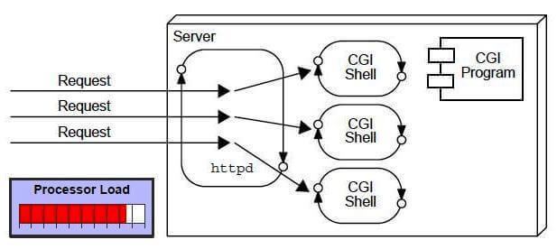
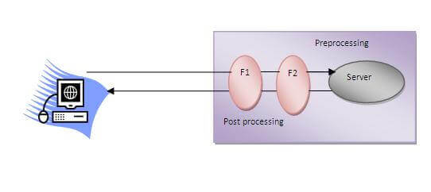

# Servlet

## what is a Servlet ?

Servlet technology is used to create a web application (resides at server side and generates a dynamic web page).

Servlet technology is robust and scalable because of java language. Before Servlet, CGI (Common Gateway Interface) scripting language was common as a server-side programming language. However, there were many disadvantages to this technology. We have discussed these disadvantages below.

There are many interfaces and classes in the Servlet API such as Servlet, GenericServlet, HttpServlet, ServletRequest, ServletResponse, etc.

### Servlet can be described in many ways, depending on the context.

- Servlet is a technology which is used to create a web application.
- Servlet is an API that provides many interfaces and classes including documentation.
- Servlet is an interface that must be implemented for creating any Servlet.
- Servlet is a class that extends the capabilities of the servers and responds to the incoming requests. It can respond to any requests.
- Servlet is a web component that is deployed on the server to create a dynamic web page.

## What is a web application?

A web application is an application accessible from the web. A web application is composed of web components like Servlet, JSP, Filter, etc. and other elements such as HTML, CSS, and JavaScript. The web components typically execute in Web Server and respond to the HTTP request.

## CGI (Common Gateway Interface)

CGI technology enables the web server to call an external program and pass HTTP request information to the external program to process the request. For each request, it starts a new process.

### Disadvantages of CGI

There are many problems in CGI technology:

- If the number of clients increases, it takes more time for sending the response.
- For each request, it starts a process, and the web server is limited to start processes.
- It uses platform dependent language e.g. C, C++, perl.

### Advantages of Servlet

There are many advantages of Servlet over CGI. The web container creates threads for handling the multiple requests to the Servlet. Threads have many benefits over the Processes such as they share a common memory area, lightweight, cost of communication between the threads are low. The advantages of Servlet are as follows:

- Better performance: because it creates a thread for each request, not process.
- Portability: because it uses Java language.
- Robust: JVM manages Servlets, so we don't need to worry about the memory leak, garbage collection, etc.
- Secure: because it uses java language.

## Servlet Filter

A filter is an object that is invoked at the preprocessing and postprocessing of a request.

It is mainly used to perform filtering tasks such as conversion, logging, compression, encryption and decryption, input validation etc.

The servlet filter is pluggable, i.e. its entry is defined in the web.xml file, if we remove the entry of filter from the web.xml file, filter will be removed automatically and we don't need to change the servlet.

So maintenance cost will be less.

### Usage of Filter

-recording all incoming requests

- logs the IP addresses of the computers from which the requests originate
- conversion
- data compression
- encryption and decryption
- input validation etc.

### Advantage of Filter

- Filter is pluggable.
- One filter don't have dependency onto another resource.
- Less Maintenance

#### The folder (my-servlet-app-with-filter) is a simple example of a Servlet Filter where RACHID is not allowed in!
