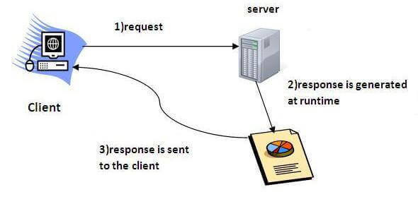

# Servlet

## what is a Servlet

Servlet technology is used to create a web application (resides at server side and generates a dynamic web page).

Servlet technology is robust and scalable because of java language. Before Servlet, CGI (Common Gateway Interface) scripting language was common as a server-side programming language. However, there were many disadvantages to this technology. We have discussed these disadvantages below.

There are many interfaces and classes in the Servlet API such as Servlet, GenericServlet, HttpServlet, ServletRequest, ServletResponse, etc.

### Servlet can be described in many ways, depending on the context.

-Servlet is a technology which is used to create a web application.
-Servlet is an API that provides many interfaces and classes including documentation.
-Servlet is an interface that must be implemented for creating any Servlet.
-Servlet is a class that extends the capabilities of the servers and responds to the incoming requests. It can respond to any requests.
-Servlet is a web component that is deployed on the server to create a dynamic web page.

